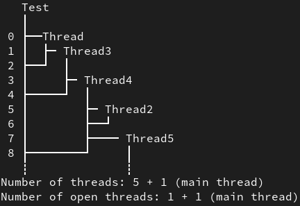

# Storythreads

A small program that depicts a story's threads on the command line to help remember where you are in the story. This tool is meant for writers but feel free to use it for any usecase if it helps you.

The names of the threads and their positioning are fully customizable to fit each individual story. The threads are shown in a position relative to each other's beginning and ending.

It helps to get an overview over the story threads that you have already resolved and that still need to be resolved.



# Usage

You will need python >= 3.7 to run this program.

Below, the basic functionality is explained. Run the help for more details (e.g. `python story-threads.py --help`).

## Show the Threads

To simply show the current threads, run:
```
python story-threads.py NewStory show
```

## Create and Close a Thread

To add a first thread to a new story of the name NewStory, run:
```
python story-threads.py NewStory add "antagonist in disguise" 0
```
You can also close it immediately:
```
python story-threads.py NewStory add "antagonist in disguise" 0 -c 1
```
Or later on:
```
python story-threads.py NewStory end "antagonist in disguise" 1
```
All new threads will be positioned relative to the existing ones, e.g. you can have it start before and end after the above example:
```
python story-threads.py NewStory add "fake-opponent plays opponent" 0 -c 2
```
The first time you create a thread for a new story, a json file with your story's name will be created to store your threads. Do not change this file manually.

Note that the main thread of your story cannot be closed or opened, it acts as a reference for the threads.

## Remove a Thread or Open a Thread

To remove a whole thread. run:
```
python story-threads.py NewStory rm "antagonist in disguise"
```
Or, if you only want to remove the closing of the thread and open it again:
```
python story-threads.py NewStory rm "antagonist in disguise" -e
```

## Change a Thread

You can also change a thread's position by changing the opening or the closing index (or both):
```
python story-threads.py NewStory change "antagonist in disguise" -o 2 -e 7
```
This will shift the opening of the thread to index 3 and the closing to index 7 from wherever it was before. An index out of bounds will always be set to the end of the list.
